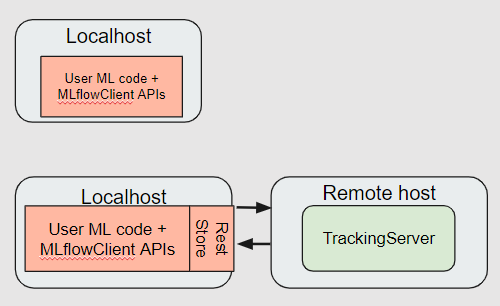
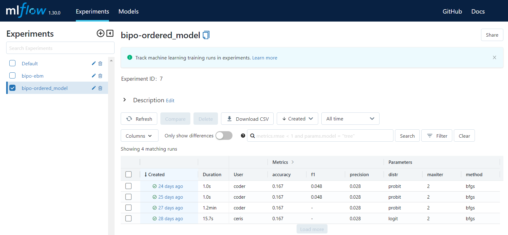
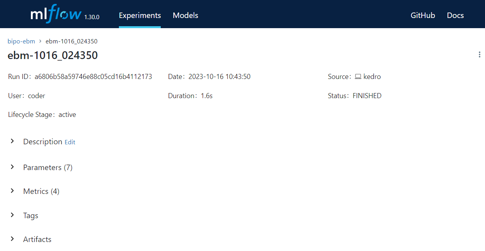

# Experiment Tracking

## Overview

[MLflow](https://mlflow.org/) is an open-source platform designed to manage the machine learning lifecycle. It is instrumental for tracking different model configurations, hyperparameters, and evaluation metrics. Effective tracking is essential for comparing various model runs, reproducing experiments, and deploying models.

Below is a visual representation of the MLflow tracking server. This server facilitates the logging and retrieval of experiment runs. It can be configured either locally or on a remote server.




### MLflow Dashboard Overview

Below is an illustrative snapshot that showcases a typical layout of the MLflow Dashboard when conducting model experiments. 



To explore further details about a specific run, click on the hyperlink located under the `Created` column. This will take you to a detailed view of that particular run's metrics, parameters, and other associated data.




## Setup

### Configuration File: `parameters.yml`

Before embarking on any experiments, make sure to adjust the MLflow configurations in the `parameters.yml` file, which is commonly housed in the `conf/base/` folder.

#### Configuration Parameters

MLflow tracking is disabled by default. You can choose to enable MLflow feature using the `enable_mlflow` parameter by setting it to `True`.

Here's a sample configuration:

```yaml
# MLflow Tracking Server
enable_mlflow: False
is_remote_mlflow: False
tracking_uri: "http://10.43.130.112:5005"
experiment_name_prefix: "bipo" # Example experiment_name: bipo-ebm
```


| Parameter                | Type   | Description                                       | Default Value               |
| ------------------------ | ------ | ------------------------------------------------- | --------------------------- |
| `enable_mlflow`          | `bool` | Whether to enable MLflow tracking                 | False                       |
| `is_remote_mlflow`       | `bool` | Whether the MLflow server is remote               | False                       |
| `tracking_uri`           | `str`  | URI for the MLflow tracking server                | "http://10.43.130.112:5005" |
| `experiment_name_prefix` | `str`  | Prefix for naming experiments (Example: bipo-ebm) | "bipo"                      |


### Tracking Modes: Local vs Remote

You can also choose to track experiments locally or on a remote server using the `is_remote_mlflow` parameter.

| Feature               | Local Tracking (`is_remote_mlflow: False`)                                                                           | Remote Server Tracking (`is_remote_mlflow: True`)                                                                           |
| --------------------- | -------------------------------------------------------------------------------------------------------------------- | --------------------------------------------------------------------------------------------------------------------------- |
| **`enable_mlflow`**   | If set to `False`, MLflow tracking is disabled regardless of the `is_remote_mlflow` setting.                         | If set to `False`, MLflow tracking is disabled regardless of the `is_remote_mlflow` setting.                                |
| **Tracking URI**      | The `./mlruns` directory is used for tracking experiments on the local machine. For example: `http://localhost:5005` | `tracking_uri` in `parameters.yml` is used to point to the remote tracking server. For example: `http://10.43.130.112:5005` |
| **Experiment Naming** | The default experiment name is used, as indicated in the default `mlruns/0/meta.yml` file.                           | The prefix from `experiment_name_prefix` is combined with the model name to form a custom experiment name.                  |
| **Accessibility**     | Experiments are only accessible on the local machine.                                                                | Experiments can be accessed remotely, provided the server is reachable.                                                     |
| **Data Storage**      | Data is stored in the local file system within the `./mlruns/` directory.                                            | Data is usually stored on the server or in a database connected to the server.                                              |
| **Setup Requirement** | No additional setup is needed.                                                                                       | Ensure the remote URI is reachable; additional authentication may be required.                                              |

### Default Parameters in Release Package

1. **`enable_mlflow: False`**: MLflow tracking is disabled by default.
2. **`is_remote_mlflow: False`**: Experiments are logged on your local machine in the `./mlruns` subdirectory of the project root.

## Configuring Experiments

### Local Tracking

Locally tracked experiments come with preset configurations that are often ideal, therefore manual adjustments are rarely required.

### Remote Server Tracking

When using a remote tracking server, the configuration is set in the `parameters.yml` file. The `setup_remote_mlflow()` function in the model training module initialises the connection to the remote MLflow tracking server by setting the tracking URI and the experiment name as per the configuration.

To create a new experiment that aligns with the `experiment_name_prefix` setting in your `parameters.yml` file, follow these steps:

1. **Access the MLflow dashboard**: Open your web browser and enter your MLflow tracking URI. It should look something like this: `http://<ip-address>:<port-number>`.

2. **Initiate a new experiment**: Locate and click the "New Experiment" button, typically found at the top-right corner of the left navigation panel.

3. **Name the experiment**: When prompted, type in the name for your experiment. Ensure you include the prefix from the `experiment_name_prefix` in the `parameters.yml` file. For instance, if the prefix is "bipo" and your model's designation is "ebm", the experiment's name ought to be "bipo-ebm".

4. **Finalise the experiment**: Click on the "Create" button to complete the experiment setup.

Following these steps ensures your remote tracking aligns with the configurations in your `parameters.yml` file.

### Troubleshooting
If you encounter issues accessing the remote server, ensure that:

- The server's URI is correct.
- The server is currently reachable.
- Any required authentication details are correctly set.

## Configuring Runs
When you start a new run in MLflow, a unique identifier, also known as a "run name", is generated for that particular run. This is important for distinguishing between various runs, especially when you are tracking multiple experiments or different configurations of the same model.

### How Run Names are Generated
The run name is automatically generated in the model training submodule. It consists of the model name and a timestamp. For example, if you are running an experiment with a model named "ebm" and the current timestamp is "1020_150102" (indicating it was run on October 20 at 15:01:02), then the generated run name will be `ebm-1020_150102`.

## Logging of Model Parameters and Performance Metrics

As model training progresses, MLflow automatically logs parameters and metrics.

### Parameters

The file `model_training.yml` in `conf/base/parameters` contains the parameters of each model supported in the training pipeline.

| Model        | Parameters Logged                                                                                                           |
| ------------ | --------------------------------------------------------------------------------------------------------------------------- |
| EBM          | - outer_bags<br/>- inner_bags<br/>- learning_rate<br/>- interactions<br/>- max_leaves<br/>- max_bins<br/>- min_samples_leaf |
| OrderedModel | - distr<br/>- method<br/>- max_iter                                                                                         |

### Performance Metrics

The model evaluation submodule calculates and logs key performance metrics, namely precision, recall, accuracy, and F1 score.

## Frequently Asked Questions

### How can I launch the MLflow UI on my local machine?

1. **Check prerequisites:**<br/>
    1.1. Ensure MLflow is installed on your machine. For installation details, see [Setting up MLflow on the Local Machine (Optional)](training-deployment-env-setup).<br/>
    1.2. Verify that the `parameters.yml` file contains the appropriate configurations, especially ensuring that MLflow tracking is enabled.
2. **Execution:** Execute the model training and evaluation process.
3. **Launching the MLflow UI:** Open a terminal or command promptand enter the command: `mlflow ui`.
4. **Accessing the MLflow UI:** Open a web browser and navigate to `http://localhost:5000`

### I wish to access the MLflow UI through a remote server. What steps should I follow?

1. **Check prerequisites:** Confirm that the `parameters.yml` file is correctly configured, especially with the details of your remote server.
2. **Execution:** Execute the model training and evaluation process.
3. **Launching the MLflow UI:** Open a terminal or command promptand enter the command: `mlflow ui`.
4. **Accessing the MLflow UI:** Open a web browser and navigate to the remote server URI, e.g. `http://10.43.130.112:5005`.
