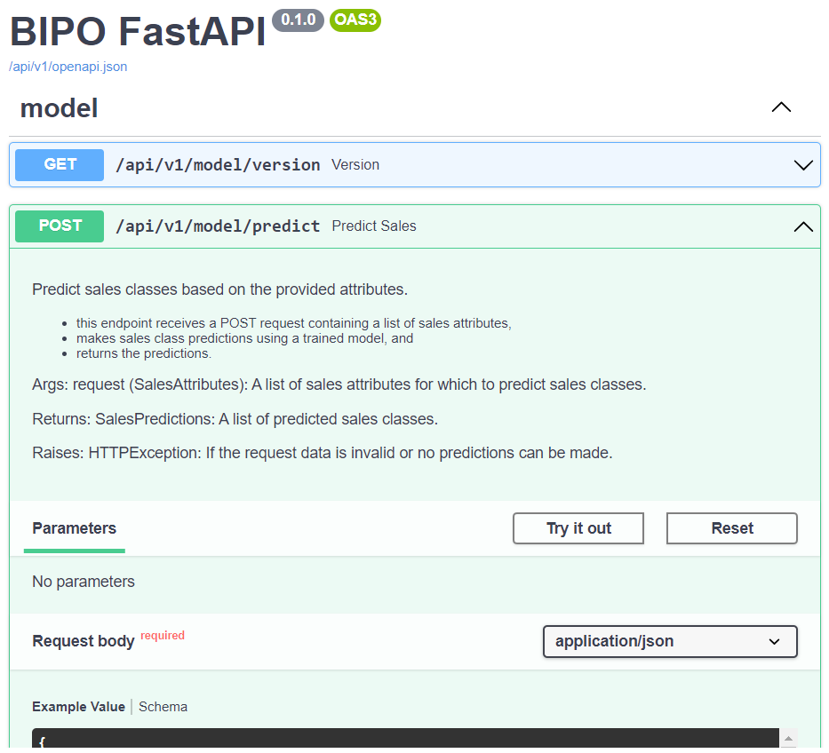

# Model Serving Endpoint

This document provides detailed information on how to interact with our model serving endpoint, which facilitates predictions through a REST API. Ensure you've followed the [`Environment Setup`](inference-deployment-env-setup) before diving in.

## Overview

Our model serving endpoint is designed to take in input data, feed it into a trained model, and deliver the model predictions in real-time. If you're unfamiliar with REST APIs, consider browsing [MDN Web Docs](https://developer.mozilla.org/en-US/docs/Web/API) or [REST API Tutorial](https://restfulapi.net/) for foundational knowledge.

## How to Run Endpoint

### 1. Starting the Endpoint
To run the Docker image containing the endpoint, execute the following command in the **root project directory**. This assumes that your model, data, and configurations are stored in specific directories on your host machine.

```bash
$ bash ./scripts/fastapi/api-entrypoint.sh
```

### 2. Interacting with the API through Swagger UI

   After starting the Docker container, you can easily interact with the API endpoints using the Swagger UI, a powerful tool for visualizing and testing API endpoints.

1. **Access the Interface**: Open your preferred web browser and navigate to the Swagger UI, located at http://<VM_IP_address>:8000/docs
2. **Submit Requests**: The interface provides an interactive platform to send requests and view responses. To initiate a request:
    1. Locate the POST `/api/v1/model/predict` endpoint.
    2. Click the `Try it out` button.
    3. Enter the JSON data conforming to the [Request Format](#request-format).
    4. Click `Execute` to send the request.
3. **Viewing Responses**: After submission, the prediction response will be displayed directly within the Swagger UI. To understand the structure and meaning of the response, refer to the [Response Format](#response-format) section.

      

### 3. Terminating the Endpoint

- **Foreground Execution**: If the Docker container was started in the foreground, simply press `Ctrl + C` in the terminal to halt it.
- **Background Execution**: If the container is running in the background, use the following command to stop it:

```bash
docker stop --name bipo_inference_initial
```
Note: Replace `bipo_inference_initial` with the name you used when starting the container, if different.

## Request Format
1. outlet_attributes
2. lag_sales_attributes
3. mkt_attributes
- Minimum number of days required for lag_sales_attributes is the first 7 days. E.g. today is 18 Oct, expected lag sales is from 4-17 Oct, and minimum lag sales to be given is from 4-10 Oct, while the remaining lag sales values will be imputed.  

The request below shows the default values.  

To obtain predictions, format your POST request as follows: 

```json
{
    "outlet_attributes": [
        {
        "inference_date": [
        "2023-10-29",
        "2023-10-30",
        "2023-10-31",
        "2023-11-01",
        "2023-11-02",
        "2023-11-03",
        "2023-11-04"
      ],
        "cost_centre_code": 201,
        "location": "West",
        "type": "dine-in",
        "factor": [
        1,
        1,
        1,
        1,
        1,
        1,
        1
      ],
        "is_daily_rainfall_total_mm": [
        false,
        false,
        false,
        false,
        false,
        false,
        false
      ],
        "maximum_temperature_c":  [
        30,
        30,
        30,
        30,
        30,
        30,
        30
      ],
        "is_public_holiday": [
        false,
        false,
        false,
        false,
        false,
        false,
        false
      ],
        "is_school_holiday": [
        false,
        false,
        false,
        false,
        false,
        false,
        false
      ],
       "is_pandemic_restrictions": [
        false,
        false,
        false,
        false,
        false,
        false,
        false
      ]}],
    "lag_sales_attributes": [
    {
        "lag_sales_date": [
        "2023-10-13",
        "2023-10-14",
        "2023-10-15",
        "2023-10-16",
        "2023-10-17",
        "2023-10-18",
        "2023-10-19"
      ],
        "lag_sales": [
        5831,
        5831,
        5831,
        5831,
        5831,
        5831,
        5831
      ]
    }
  ],
    "mkt_attributes": [
    {
        "campaign_name": "campaign 1",
        "campaign_start_date": "2023-10-01",
        "campaign_end_date": "2023-10-30",
        "marketing_channels": [
        "TV Ad",
        "Radio Ad",
        "Instagram Ad",
        "Facebook Ad",
        "Youtube Ad",
        "Poster Campaign",
        "Digital"
      ],
        "total_cost": [
        0,
        0,
        0,
        0,
        0,
        0,
        0
      ]
    }
  ]
}
```
### outlet_attributes
| Attribute             | Type        | Description                                                                                                   |
| --------------------- | ----------- | ------------------------------------------------------------------------------------------------------------- |
| `inference_date`                | List[str]         | List of dates linked to the inference period attributes, formatted as "YYYY-MM-DD".                                               |
| `cost_centre_code`    | int         | Numeric code identifying the cost centre.                                                                     |
| `location`            | str         | Geographical point where the sale occurred.                                                                   |
| `type`                | str         | Category or classification of the sale (e.g., retail, online).                                                |
| `factor`   | List[float]       | List of scores indicating likelihood or propensity of sales, with higher values signaling greater likelihood.          |
| `is_daily_rainfall_total_mm`          | List[bool]        | List of boolean values: True if it rained on the given date; otherwise False.                                                         |
| `maximum_temperature_c`            | List[float]       | List of the day's highest recorded temperature in degree celcius.                                                                |
| `is_public_holiday`   | List[bool]        | List of boolean values: True if the date is a public holiday; otherwise False.                                                        |
| `is_school_holiday`   | List[bool]        | List of boolean values: True if the date falls within school holiday periods; otherwise False.                                        |
| `is_pandemic_restrictions`   | List[bool]        | List of boolean values: True if there are pandemic restrictions implemented on that day; otherwise False.                                        |
<br>

### lag_sales attributes
| Attribute             | Type        | Description                                                                                                   |
| --------------------- | ----------- | ------------------------------------------------------------------------------------------------------------- |
| `lag_sales_date`                | List[str]         | List of dates linked to the lag sales attributes, formatted as "YYYY-MM-DD".                                               |
| `lag_sales`           | List[float] | Sequential list of sales figures from the last 14 days, starting from the previous day up to two weeks prior. |
<br>

### mkt_attributes
| Attribute             | Type        | Description                                                                                                   |
| --------------------- | ----------- | ------------------------------------------------------------------------------------------------------------- |
| `campaign_name`       | str         | Designation of the associated marketing campaign.                                                             |
| `campaign_start_date` | str         | Date when the marketing campaign commenced, formatted as "YYYY-MM-DD".                                        |
| `campaign_end_date`   | str         | Date when the marketing campaign concluded, formatted as "YYYY-MM-DD".                                        |
| `marketing_channels`   | List[str]         | List of marketing channels.                                        |
| `total_cost` | List[float]       | List of aggregate expenditure associated with the campaign for each marketing channel.                                                |

### Optional Fields
If not applicable (i.e. no ongoing marketing campaign during the inference period), leave `campaign name` empty from the request, and ensure `campaign_start_date` and `campaign_end_date` are given arbitrary values outside of the inference period. 

For example, if the inference period is from 20-26 Oct 2023, the below request for mkt_attributes could be:

```json
"mkt_attributes": [
    {
        "campaign_name": "",
        "campaign_start_date": "2022-10-01",
        "campaign_end_date": "2022-10-30",
        "marketing_channels": [
        "TV Ad",
        "Radio Ad",
        "Instagram Ad",
        "Facebook Ad",
        "Youtube Ad",
        "Poster Campaign",
        "Digital"
      ],
        "total_cost": [
        0,
        0,
        0,
        0,
        0,
        0,
        0
      ]
    }
  ]
```


## Response Format

The server's response contains the prediction for 7 consecutive days which is the default. The response below shows the prediction for 2 days for simplicity. 

```json
{
  "sales_predictions": [
    {
      "date": "2023-10-29",
      "cost_centre_code": 201,
      "sales_class_id": "1",
      "sales_class_name": "Medium",
      "probabilities": {
        "0": 0.3467,
        "1": 0.4099,
        "2": 0.2433,
        "3": 0.0001
      }
    },
    {
      "date": "2023-10-30",
      "cost_centre_code": 201,
      "sales_class_id": "1",
      "sales_class_name": "Medium",
      "probabilities": {
        "0": 0.3477,
        "1": 0.3982,
        "2": 0.2541,
        "3": 0.0001
      }
    },
  ]
}
```
| Attribute           | Type             | Description                                                                                             |
| ------------------- | ---------------- | ------------------------------------------------------------------------------------------------------- |
| `sales_predictions` | list             | List of sales forecasts corresponding to input data.                                                    |
| `date`              | str              | Date of the prediction in "YYYY-MM-DD" format, matching the input API request.                          |
| `cost_centre_code`  | int              | Identifier for a specific outlet, matching the input API request.                                       |
| `sales_class_id`    | str              | ID linked to the class with the highest probability from the `probabilities` attribute.                 |
| `sales_class_name`  | str              | Descriptive name based on `sales_class_id` and the highest probability.                                 |
| `probabilities`     | Dict[str, float] | Dictionary mapping class IDs to likelihood scores, determining `sales_class_id` and `sales_class_name`. |

### Mapping of `sales_class_id` to `sales_class_name`: 

| `sales_class_id` |       `sales_class_name`       |
|---|---|
| 0 |       Low       |
| 1 |       Medium       |
| 2 |       High       |
| 3 |       Exceptional       |

The `date` and `cost_centre_code` attributes serve as a mapping to the respective fields in the input API request payload, ensuring alignment and traceability between the request and response.

#### Example

For the entry on "2023-10-29" with a "cost_centre_code" of 201, the probabilities are {"0": 0.3467, "1": 0.4099, "2": 0.2433, "3": 0.0001}. 
- As 0.4099 is the highest probability, the corresponding `sales_class_id` is "1" and `sales_class_name` is "Medium". 
  
Similarly, for "2023-10-30", the highest probability is 0.3982, resulting in a `sales_class_id` of "1" and a `sales_class_name` of "Medium".

## API Error Codes

When interacting with the API, you may occasionally encounter error responses. To help you navigate these situations, we've provided explanations for some of the more common error status codes:

|Error code|Description|
|---|---|
|400 (Bad Request)|This indicates that the server couldn't understand the request due to invalid syntax or format. Before making another request:<ul><li>Ensure that the API request payload adheres to the expected format.</li><li>Double-check against the [Request Format](#request-format) section to ensure accuracy.</li></ul>|
|500 (Internal Server Error)|This is a catch-all error, indicating unexpected conditions on the server side. Possible steps to troubleshoot include:<ul><li>Review server logs for detailed error messages.</li><li> Ensure the server environment and dependencies are correctly set up.</li><li> If the issue persists, reach out to the technical support or the system administrator for assistance.|
  
For a deeper dive into HTTP status codes and their meanings, you can explore the [HTTP Status Codes on REST API](https://restfulapi.net/http-status-codes/).
