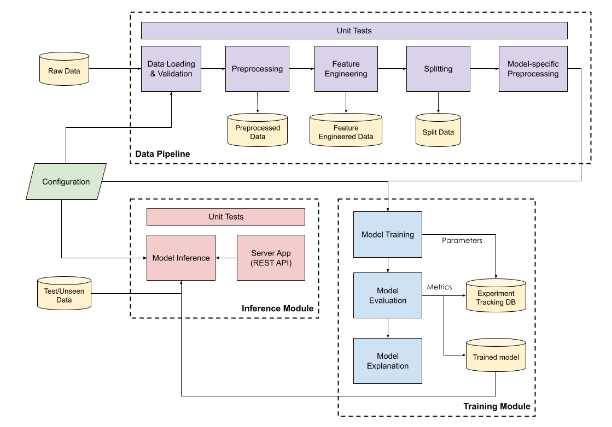
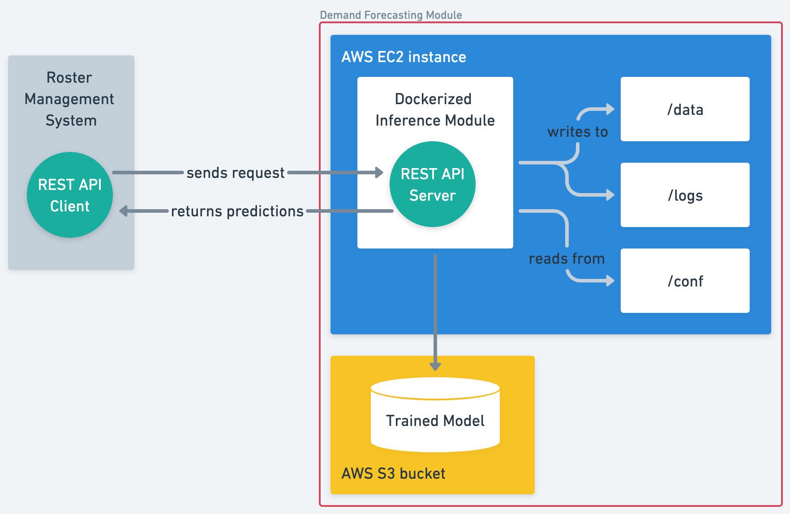

# BIPO Demand Forecasting Module: Project Overview

## Purpose of Documentation

This documentation serves as a guide for the technical user in deploying and using the inference submodule on a typical Linux system. 

The reader is expected to have familiarity with using the command line and the Linux environment.

This guide does not provide any information pertaining to:
- Training submodule
- Data pipeline submodule
- Deployment on cloud

## 1. Architecture

## 1.1. Solution Architecture
This diagram shows the complete architecture of the Demand Forecasting module.



## 1.2. Initial Deployment Architecture
The following diagram illustrates how an external system may interact with the Demand Forecasting inference submodule via the REST API, as well as the overall internal structure of the submodule.



## 2. Deployment Package Contents
```
├── bipo_demand_forecasting/
    ├── conf/ (Created and to be bind mounted)
    |    └── base/
    |        ├──parameters.yml
    |        ├──logging.yml
    |        ├──logging_inference.yml
    |        └──constants.yml
    |        └──catalog.yml
    ├── data/ (Created and to be bind mounted)
    ├── logs/ (Created and to be bind mounted)
    ├── models/ (Created and to be bind mounted)
    └── docker/(Created)
```

### 2.1. Configuration

| Path | Description |
| :- | - |
| **conf/base/** | Contains all `.yml` configuration files. |
| parameters.yml | Adjustable parameters |
| logging.yml | Logging configuration for kedro |
| logging_inference.yml | Logging configuration for inferece |
| constants.yml | Defined constants for use in Python script. Should not be edited. |
| catalog.yml | Optional |

### 2.2. Data

| Path | Description |
| :- | - |
| **data/** | Contains all data used and generated by the inference submodule |
|10_model_inference_output|Subdirectory to store intermediate api request and response in json format.|

### 2.3. Logs

| Path | Description |
| :- | - |
| **logs/** | Contains all logs generated by the system.|
|info.log|Logs events that occurred in general|
|error.log|Logs events with errors encountered|

### 2.4. Docker image

The Docker image will be provided as a `.tar` archive, named `100E_BIPO_docker_inference.tar`.

| Path | Description |
| :- | - |
| **docker/** | Contains all docker archive files. Containerised image are exported into `.tar` archive files and stored here for loading into AWS ECR.|

### 2.5. Trained model file(s)

The trained model file would be stored in an AWS S3 bucket. To ensure successful download, necessary S3 permissions are required to be configured in AWS Roles settings by the AWS administrator. 

| Path | Description |
| :- | - |
| **models/** | Contains all trained models saved in pickle format used in the pipeline, with `.pkl` as extension. |
|`orderedmodel_prob_20230816.pkl`|Trained model for inferencing. Model supported for initial deployment is *OrderedModel* from the statsmodels library|

### 2.6. Scripts
| Path | Description |
| :- | - |
| **scripts/** | Contains scripts to run on the host machine, with `.sh` as extension. |
|`docker_run.sh`|Script to load and run the docker image for inference.|
|`apt-install.sh`|Script to install all required packages.|

### 2.7. OS port usage

Any firewall configurations or other applications installed should not be using the stated ports:

| Port | Description |
| :- | - |
| 2375 | Docker unencrypted communication |
| 2376 | Docker encrypted communication |
| 8000 | FastAPI endpoint|

## 3. File Structure in Container

The following file structure depicts the key directories and files contained in the containerised inference submodule. **This is not the same directory with the host computer which docker is running.**

```
├──/app/bipo_demand_forecasting/
    ├── conf/ (mounted)
    ├── data/ (mounted)
    ├── docker/ 
    ├── models/ (mounted)
    ├── logs/ (mounted)
    │   ├── info.log
    │   └── error.log
    ├── scripts/
    └── src/
        ├── bipo/
        │   ├── inference_pipeline/
        │   │   ├──data_preprocessing.py
        │   │   ├──feature_engineering.py
        │   │   ├──model_specific_fe.py    
        │   │   └──inference_pipeline.py
        │   ├── pipelines/
        │   │   └── ...
        ├── bipo_fastapi/
        │   ├── v1/ (model inference)
        |   │   └── routers/ (code separation into multiple files)
        │   ├── config.py
        │   ├── deps.py
        │   ├── logs.py
        │   ├── main.py (entrypoint for inference)
        │   ├── schemas.py
        │   └── ...
        ├── requirements.txt
        └── utils.py
```
