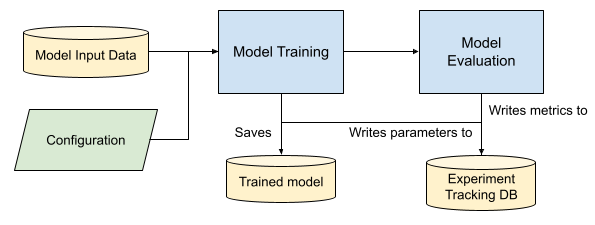

# Training Pipeline

## Overview
This section outlines the overall architecture, respective modules, the data inputs/outputs and the relevant configurations used by the pipeline. This pipeline should be executed after data pipeline has been executed, as data would have been processed for model training.

## Design Architecture and Considerations:
1. **Modularity**: Flexibility and maintainability of components.
2. **Module Decoupling**: Faster adaptation to changing requirements without significant overall impact to entire program as much as possible.
3. **Configurability**: To facilitate experimentation of various data/model manipulataion approaches.
4. **Containerization**: To support iterative experiments involving hyperparameter tuning or configuration by different users.

The training pipeline architecture below provides a high-level overview of the key processes in model training.



Key processes in the architecture:
1. Model input data from `data/06_model_specific_preprocessing` is used in both model training and model evaluation modules.
2. Pipeline parameters and model hyperparameters can be configured in `parameters.yml` and `model_training.yml` respectively.
3. Model Training module will generate model weights that are stored in `models` folder, which is a mounted directory.
4. Model Evaluation module will utilise generated model weights in previous process from `models` folder, and data from `data/06_model_specific_preprocessing` to generate evaluation metrics. The evaluation metrics would then be stored in `data/07_model_evaluation`.
5. **(Optional)** Model experimentation results could be written to an experimentation tracking database if required. The existing program provided has included MLflow library python support to enable linkedup with local/on-prem MLflow server. When MLflow is enabled locally, MLflow artefacts (model parameters and metrics) would be stored in `mlruns` folder.

## Supported models

The following table lists down the model that is currently implemented.
| Model | Description | Reference repository |
| --- | --- | --- |
| Ordered Model | Ordered Model uses ordinal regression which is a statistical technique that is used to predict behavior of ordinal level dependent variables with a set of independent variables. The dependent variable is the order response category variable and the independent variable may be categorical or continuous. | [GitHub](https://github.com/statsmodels/statsmodels/) |
| Explainable Boosting Machine (EBM) | Explainable Boosting Machine (EBM) is a tree-based, cyclic gradient boosting Generalized Additive Model with automatic interaction detection. EBMs are often as accurate as state-of-the-art blackbox models while remaining completely interpretable. Although EBMs are often slower to train than other modern algorithms, EBMs are extremely compact and fast at prediction time. | [GitHub](https://github.com/interpretml/interpret) |

# Training Pipeline Configuration

## Overview

This section provides information on key parameters from the files `parameters.yml`, `constants.yml` contained in `conf/base/` directory, as well as `model_training.yml` file in `conf/base/parameters` directory. Due to the volume of parameters, we will only include a selection for illustrative purposes. These files can be found in `conf/base/` directory.
<br />

## Explanation on the purpose of yml files placement locations

There are two separate folder placements of yml files, namely in `conf/base/` and `conf/base/parameters`. Yml files placed in `conf/base` is primarily shared across different Kedro pipeline modules, to facilitate single configuration entrypoint that can be used across the entire pipeline. In the other case, yml files in `conf/base/parameters` are identified by its module name naming convention (e.g `model_training.yml` in current context) governs the configuration control for a specific pipeline module, so as to facilitate possible experimentations of values.

## Key Parameters in the `parameters.yml` File

This sub-section outlines the key parameters in the `parameters.yml` configuration file that control different aspects of the training pipeline. The file is divided into several sections, each dealing with a specific part of the pipeline. Here's a breakdown:
<br />

### Configurations for various modules
<br />

**Model Training Module: General**
| Parameter | Type | Description | Default Value |
| --- | --- | --- | --- |
| `model` | `str` | Model to use. Supported models: `ordered_model` or `ebm`. | 'ebm' |
| `fold` | `int`| The fold number of the processed data derived from Data Split module to be used for model training. | 1 |
---
<br />

**Model Training Module: Model Explanability**
- Please note that current support for model explanability is only EBM model.

| Parameter | Type | Description | Default Value |
| --- | --- | --- | --- |
| `enable_explainability` | `bool` | Specifically for EBM only. `True` will allow EBM to generate global and local explanations. Files will be generated in `models/ebm_explanation/` folder. Visit [model-explanation section](model-explanation) for more details. | `True` |
| `output_type` | `str` | EBM explainability file generated to be `html` or `png` | `html` |
| `feature_to_explain_list` | `list` | Features of interest for local explanations. <br /> Set to empty list "`[ ]`" if no features are required.  | `["factor", "is_weekday"]` |
---
<br />

**Model Training Module: MLflow Tracking Server**
| Parameter | Type | Description | Default Value |
| --- | --- | --- | --- |
| `enable_mlflow` | `bool` | Control to enable/disable MLflow server usage as part of experimentation process. | False |
| `is_remote_mlflow` | `bool` | Control that determines if MLflow server is remote (True) or local (False). | False |
| `tracking_uri` | `str`  | URI of MLFlow server. | 'http://10.43.130.112:5005' |
| `experiment_name_prefix` | `str`  | MLflow experiment name to use, example experiment_name: bipo-ebm. | 'bipo' |
---
<br />

### Key Parameters in the `model_training.yml` File

This sub-section outlines the key parameters in the `model_training.yml` configuration file which handles provided configurable parameters for the hyperparameters to be used in the process of model training. It is broken down into sections, each detailing a specific type of data split.


The following tables below contains configurable models' hyperparameters which are currently supported by the program implementation.

**OrderedModel Configuration (under `ordered_model` key)** 

| Parameter | Type | Description | Default Value |
| --- | --- | --- | --- |
| `distr` | `str` | `probit` for normal distribution or `logit` for logistic distribution. Refer [HERE](https://www.statsmodels.org/dev/generated/statsmodels.miscmodels.ordinal_model.OrderedModel.html#statsmodels.miscmodels.ordinal_model.OrderedModel-parameters) for more infomation. | `probit` |
| `method` | `str` | The method determines which solver from scipy.optimize is used. Refer [HERE](https://www.statsmodels.org/dev/generated/statsmodels.miscmodels.ordinal_model.OrderedModel.fit.html#statsmodels.miscmodels.ordinal_model.OrderedModel.fit) for more infomation.| `bfgs` |
| `max_iter` | `int` | The maximum number of iterations to perform. | `10` |

**EBM Configuration (under `ebm` key)** 

For more details, refer to the [InterpretML API documentation](https://interpret.ml/docs/ExplainableBoostingClassifier.html) for the complete list of hyperparameters.

| Parameter | Type | Description | Default Value |
| --- | --- | --- | --- |
| `outer_bags` | `int` | Number of outer bags. Outer bags are used to generate error bounds and help with smoothing the graphs. | `8` |
| `inner_bags` | `int` | Number of inner bags. 0 turns off inner bagging. | `0` |
| `learning_rate` | `float` | Learning rate for boosting. | `0.01` |
| `interactions` | `int` | Interaction terms to be included in the model.| `0` |
| `max_leaves` | `int` | Maximum number of leaves allowed in each tree. | `3` |
| `max_bins` | `int` | Max number of bins per feature for the main effects stage. | `256` |
| `min_samples_leaf` | `int` | Minimum number of samples allowed in the leaves. | `2` |

### Key Parameters in the `constants.yml` file
---
This sub-section outlines the key parameters in the `constants.yml` configuration file. The file is organised into multiple sections to cater to different modules of data pipeline.

Please note that these file is intended for 2 purposes:
- **Configured value serves as a fallback for invalid parameters set in `parameters.yml` or required parameters that are missing. Note that not all parameters are covered in this `constants.yml`, as it is not feasible to make assumption on valid values for some parameters**; and
- **Global 'constants' which is shared.**

**Default Configurations for Model Training (under modeling key)**
| Parameter | Type | Description | Default Value |
| --- | --- | --- | --- |
| `valid_model_name_list` | `list` | List containing names of supported model in snakecase. Modify if models to be experimented would be changed. | ["ebm", "ordered_model"] |
| `default_model` | `str` | Default model to use when name of model to use in `parameters.yml` does not belong to default values stated in `valid_model_name_list` parameters. |"ebm"|
| **Config using nested dictionary for EBM** | | | |
| `ebm` | `dict` | Dictionary containing default EBM model hyperparameters as override when required keys for EBM hyperparameters tuning in `parameters.yml` are not found. | - |
| ↳ `outer_bags` | `int` | Number of outer bags. Outer bags are used to generate error bounds and help with smoothing the graphs. | `10` |
| ↳ `inner_bags` | `int` | Number of inner bags. 0 turns off inner bagging. | `0` |
| ↳ `learning_rate` | `float` | Learning rate for boosting. | `0.01` |
| ↳ `interactions` | `int` | Interaction terms to be included in the model.| `0` |
| ↳ `max_leaves` | `int` | Maximum number of leaves allowed in each tree. | `3` |
| ↳ `max_bins` | `int` | Max number of bins per feature for the main effects stage. | `256` |
| ↳ `min_samples_leaf` | `int` | Minimum number of samples allowed in the leaves. | `2` |
| **Config using nested dictionary for OrderedModel** | | | |
| `ordered_model` | `dict` | Dictionary containing default OrderedModel hyperparameters as override when required keys for OrderedModel hyperparameters tuning in `parameters.yml` are not found. | - |
| ↳  `distr` | `str` | `probit` for normal distribution or `logit` for logistic distribution. Refer [HERE](https://www.statsmodels.org/dev/generated/statsmodels.miscmodels.ordinal_model.OrderedModel.html#statsmodels.miscmodels.ordinal_model.OrderedModel-parameters) for more infomation. | `probit` |
| ↳  `method` | `str` | The method determines which solver from scipy.optimize is used. Refer [HERE](https://www.statsmodels.org/dev/generated/statsmodels.miscmodels.ordinal_model.OrderedModel.fit.html#statsmodels.miscmodels.ordinal_model.OrderedModel.fit) for more infomation.| `bfgs` |
| ↳  `max_iter` | `int` | The maximum number of iterations to perform. | `2` |

## Model Input Data Definition
The training pipeline accepts the raw data that was processed by the entire `data pipeline`, which resides in `06_model_specific_preprocessing`. 

The following data definition is accurate for the trained model weights released on 19 October 2023. 

| Column | Type | Description
| --- | --- | --- |
| `maximum_temperature_c` | `float` | Max temperature detected for the day |
| `factor` | `float` | National aggregation of propensity to spend. |
| `name_counts` | `int` | Number of active marketing campaigns ongoing for the day. |
| `is_name_start` | `int` | Boolean feature indicator (represented in int , with 1 = True, 0 = False) feature representing if the day is a start of another marketing campaign. |
| `is_name_end` | `int` | Boolean feature indicator (represented in int , with 1 = True, 0 = False) feature representing if the day is a end of another marketing campaign. |
| `is_weekday` | `int` | Boolean feature indicator (represented in int , with 1 = True, 0 = False) indicating if the day is weekday. |
| `is_school_holiday` | `int` |  Boolean feature indicator (represented in int , with 1 = True, 0 = False) indicating if the day is weekday. |
| `is_public_holiday` | `int` | Boolean feature indicator (represented in int , with 1 = True, 0 = False) indicating if the day is a public holiday. |
| `is_daily_rainfall_total_mm` | `int` | Boolean feature indicator (represented in int , with 1 = True, 0 = False) indicating if the day is raining (based on daily_total_rainfall exceeding 0.2mm condition). |
| `is_pandemic_restrictions` | `int` | Boolean feature indicator (represented in int , with 1 = True, 0 = False) indicating if there are pandemic restrictions imposed. |
| `lag_9_proxyrevenue` | `float` | Proxy revenue lagged by 9 days. |
| `lag_14_proxyrevenue` | `float` | Proxy revenue lagged by 14 days. |
| `lag_9_sma_7_days_proxyrevenue` | `float` | Simple moving average using 7 day window lagged by 9 days. |
| `lag_mean_1_week_proxyrevenue` | `float` | Weekly average of proxyrevenue lagged by 1 week. |
| `lag_mean_2_week_proxyrevenue` | `float` |  Weekly average of proxyrevenue lagged by 2 weeks. |
---
<br />

## How to execute the Training Pipeline (Windows OS only) from a Docker image

This guide explains how to run the training pipeline using either of the **two** methods outlined below in a Windows OS environment. It assumes that you have load the required docker image onto the host machine and executed the data pipeline to generate the processed datasets.

### 1. Via windows Batch Script (Docker Container)

#### Prerequisites
- Ensure `data`, `conf`, `models`, `logs` and `mlruns` folders are present in the directory where docker image is running.
    - If you want to train `ordered_model` or `ebm`, please ensure `06_model_specific_preprocessing/ordered_model` or `06_model_specific_preprocessing/ebm_model` folders are present.
- The correct `image_name` and `docker_registry` (optional) should be defined in `run_model_training.bat` provided parameters as per below.

```
...
set docker_registry=registry.aisingapore.net/100e-bipo
set image_name=bipo-training-pipeline:0.1.3
...
```

#### Purpose of `run_model_training.bat` script
1. Pulls training pipeline Docker image from Docker registry if `docker_registry` is specified. Else it assumes the existing image has been loaded onto the host machine.
2. Runs the Docker image as a docker container and mount the directories, `data`, `conf`, `models`, `logs` and `mlruns` as docker volumes to the docker container.  
3. If MLflow is enabled via `parameters.yml` , script will run `mlflow ui` on local machine and experiment tracking can be observed in `http://127.0.0.1:5000` on local machine. 

#### Executing the bat script

Run the following command in your **Windows's cmd/powershell/terminal** console to execute `run_model_training.bat`:

~~~powershell
.\scripts\run_model_training.bat   
~~~
You should see output similar to the below:
~~~
Status: Image is up to date for registry.aisingapore.net/100e-bipo/bipo-training-pipeline:0.1.2
registry.aisingapore.net/100e-bipo/bipo-training-pipeline:0.1.2
"Successfully pull image: registry.aisingapore.net/100e-bipo/bipo-training-pipeline:0.1.2"
"Starting docker run with image: registry.aisingapore.net/100e-bipo/bipo-training-pipeline:0.1.2 "
16cfe16e9f25993737c29b3b3ffb45c138a260d5c5e517dc27d37d711b4e7dfe
"Training Pipeline Docker Container run successfully"
"mlflow is installed on your local environment. Running mlflow"
INFO:waitress:Serving on http://127.0.0.1:5000
~~~

### 2. Via direct command line in code repository provided

#### Prerequisites
- Please ensure that the Conda environment/Python environment is activated on your local machine. You would need to at run the data pipeline first in order to generate processed data for model training purposes. The outputs would reside in the folder `data/06_model_specific_preprocessing`.

#### Command to execute

Run the following commands in your terminal window, which specifies the `pipeline` argument as `training_pipeline` to run the training pipeline.
This should be executed in the project root folder.

```
kedro run --pipeline=training_pipeline
```

You should see output with an ending showing a successful completion similar to the below:
```
18/10/2023 12:47 | kedro.io.data_catalog | INFO | Saving data to 'ebm.model_evaluation_val_result' (JSONDataSet)...
18/10/2023 12:47 | kedro.runner.sequential_runner | INFO | Completed 7 out of 7 tasks
18/10/2023 12:47 | kedro.runner.sequential_runner | INFO | Pipeline execution completed successfully.
```

## Model Evaluation

The table below summarises the metrics currently used and logged by the training pipeline during the model evaluation stage.

| Metrics | Description |
| --- | --- |
| Accuracy | The measure of the overall correctness of a model. It represents the ratio of correctly predicted instances to the total instances in the dataset. |
| Precision | The measure of the accuracy of positive predictions made by the model. It's the ratio of true positive predictions to all positive predictions made by the model. |
| Recall | Recall measures the ability of a model to identify all relevant instances, specifically true positives. It's the ratio of true positives to all actual positive instances in the dataset. |
| F1 Score | Harmonic mean of precision and recall. It provides a balanced measure of model performance, taking into account both false positives and false negatives. |
<br />

## Possible Error and Handling
### Training Ordered Model 
The parameterization of OrderedModel requires that there is no constant in the model, neither explicit nor implicit.By default, the `data pipeline` will check for any constant values and remove them. 

However, if OrderedModel still detects constant values and `raise ValueError("There should not be a constant in the model")`, an exception handling is included based on suggested approach from online, which skips constant value check. Refer [HERE](https://www.statsmodels.org/stable/examples/notebooks/generated/ordinal_regression.html#Using-formulas---no-constant-in-model) for more infomation. 
~~~
# Example usage
model = OrderedModel(y_train,X_train,distr='probit', hasconst=False)
~~~

## File Structure layout in Docker container

The following file structure depicts the key directories and files contained in the containerised training submodule. **This is not the same directory with the host computer on which Docker is running.**

```
├──/app/bipo_demand_forecasting/
    ├── pyproject.toml
    ├── conf/ (mounted)
    ├── data/ (mounted)
    ├── mlruns/ (mounted)
    ├── models/ (mounted)
    ├── logs/ (mounted)
    │   ├── info.log
    │   └── error.log
    └── src/
        ├── bipo/
        │   ├── pipelines/
        │   │   └── ...
        ├── requirements.txt
        └── utils.py
```
